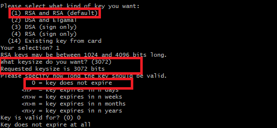

# Precommit Hook POC

## Why use it

We don't want to expose our secret in the repository. For that, we can use git-secret, this tool will encrypt the files we need to hide and the registered developers will be able to decrypt that data in their machines.

## Setup

Follow the installation guide from [git-secret-installation-guide](https://git-secret.io/installation) (I could do it using the Manual option in Git Bash without the PREFIX option)

Then you need to create a gpg pair key for each user. For that we use: `gpg --full-generate-key`. 

Some options will appear in the console, and we follow the default ones: 

* (1) RSA and RSA
* 3072
* 0 = key does not expire

After that gpg will ask for personal data such us our name and email. This data will be attached to the key so we can identify it.

We have to deliver the public key to the administrator, so he can add it to the git-secret keys registry.

We can export the key using the command `gpg --output {username}.gpg --export {useremail}`. 

And to import it we use: `gpg --import {username}.gpg`.

## How to use

Ones we have the git-secret installed and the gpg pair keys generated, we can start using git-secret using the following commands:

`git-secret init`: Initialize the git-secret tool in our project.

`git-secret tell {email}}`: Add a user who will be able to access the hidden files.

`git-secret add {filename}}`: Add a file which will be encrypted by git-secret.

`git-secret hide`: Encrypt all files added to git-secret.

`git-secret reveal`: Decrypt all files added to git-secret using the user gpg key.

For more information about the git-secret commands refer to it [page](https://git-secret.io/#commands).
